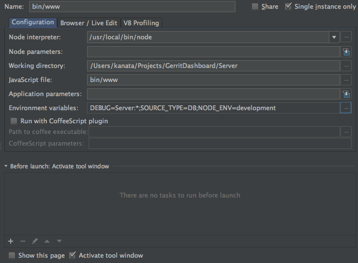

# Gerrit Dashboard Server


[](https://microbadger.com/images/monitise/gerritdashboard-server "Get your own image badge on microbadger.com")

Gerrit Dashboard Server project that aggregates & serves metrics about the projects, reviews and commits with
various filters.

## License

Gerrit Dashboard Server
Copyright © 2016 Monitise MEA

Distributed under the Apache License, Version 2.0

## Requirements

Currently the only requirement is node.js itself. Server works with either gerrit's API or with direct DB
connection. Though DB is default, this behaviour can be controlled with `SOURCE_TYPE` environment variable.

* nodejs (>= 4.4.1)
* gerrit (>= 2.8, optional, for SOURCE_TYPE=API only)
* gulp (optional, for packaging only)
* docker (optional)
* mysql (optional, for SOURCE_TYPE=DB only)

## Configuration

There are some required environment variables you need to define before developing or booting the app.

### Environment Variables

* **GERRIT_DASHBOARD_CONFIG_PATH:** Defines the path for configuration files. (Default: `config/`)

* **NODE_ENV:** Defines whether environment is for development or production.

    * development
    * production (default)

* **SOURCE_TYPE:** Defines which backend will be used for fetching data.

    * API: Requires `gerrit.json` in `GERRIT_DASHBOARD_CONFIG_PATH`
    * DB: Requires `database_config_<NODE_ENV>.json` in `GERRIT_DASHBOARD_CONFIG_PATH`

### Backend Configuration

For `gerrit.json` you can use the following template:

```
{
    "host": "gerrit.example.com",
    "username": "gerrit_user",
    "password": "gerrit_pass"
}
```

For direct database access (regardless of it's development or production) you can use the template below. Using a
replicated slave is better here in terms of performance.

```
{
    "host": "db.example.com",
    "user": "gerrit_db_user",
    "password": "gerrit_db_pwd",
    "database": "gerrit_db_name"
}
```

### Cache Configuration

You can configure caching intervals in `config/cache-config.json`.

## Development

#### Using CLI:

```
$ npm install
$ NODE_ENV=development SOURCE_TYPE=DB ./bin/www
```

#### Using IDEA:

Select Node.js under Run/Debug Configurations with the options below. Make sure _"Include Parent Environment Variables"_
is turned off under _Environment Variables_.



## Deployment

### Docker (Recommended)

A docker file has been created for containerization of this project. By default, it's configured to run in production
mode with DB as source type.

`/opt/config` has been set as `GERRIT_DASHBOARD_CONFIG_PATH`. This path will be mounted from the host server and should
contain necessary configuration files according to above description.

To build the container image:

```
$ docker build -t gerrit-dashboard-server:1.0.0 .
```

To tag the image as latest:

```
$ docker tag gerrit-dashboard-server:1.0.0 gerrit-dashboard-server:latest
```

To spin a new container from this image:

```
$ docker run -d \
    --name gerrit-dashboard-server \
    -p 3000:3000 \
    -v $PROJECT_CONFIG_DIR/gerrit-dashboard-server:/opt/config \
    gerrit-dashboard-server
```

To change environment variable defaults:

```
$ docker run -d \
    --name gerrit-dashboard-server \
    -p 3000:3000 \
    -e NODE_ENV=development \
    -v $PROJECT_CONFIG_DIR/gerrit-dashboard-server:/opt/config \
    gerrit-dashboard-server
```

In both of the above commands, change `$PROJECT_CONFIG_DIR` according to your will.

## Endpoints

**1. /dashboard**

Returns dashboard summary as JSON:

```
{
    "totalNumberOfProjects": number,
    "numberOfReviews": {
        "open": number,
        "merged": number,
        "abandoned": number,
        "draft": number
    },
    "averageReviewInterval": number
}
```

**2. /stats**

Returns detailed statistics as JSON:

```
{
    "numberOfCommits": number,
    "mostCommitedProjects": {
        "name": string,
        "commits": number
    },
    "topCommitters": {
        "name": string,
        "commits": number
    }
    "topReviewers": {
        "name": string,
        "reviews": number
    }
}
```

Querying on `/stats` is possible by making a request to: `/stats?filter=TODAY&limit=n`

The default value of filter is `filter=TODAY`. And default value of `limit=5`.

Filter can be one of these:

* TODAY
* THIS_WEEK
* THIS_MONTH
* LAST_30_DAYS
* LAST_6_MONTHS

**3. /version**

Returns application version as JSON:

```
{
    "version": version number,
    "status": boolean
}
```
